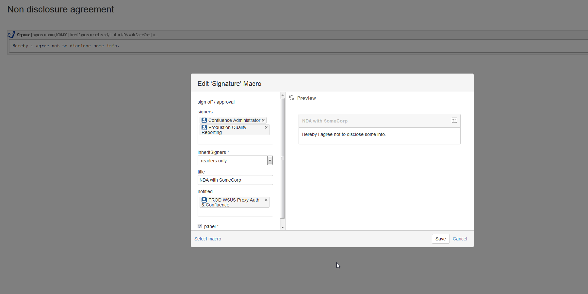
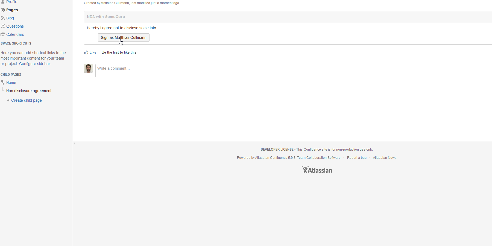
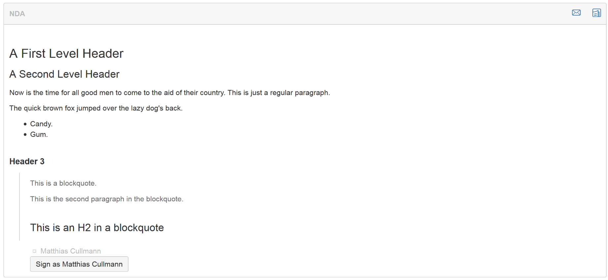
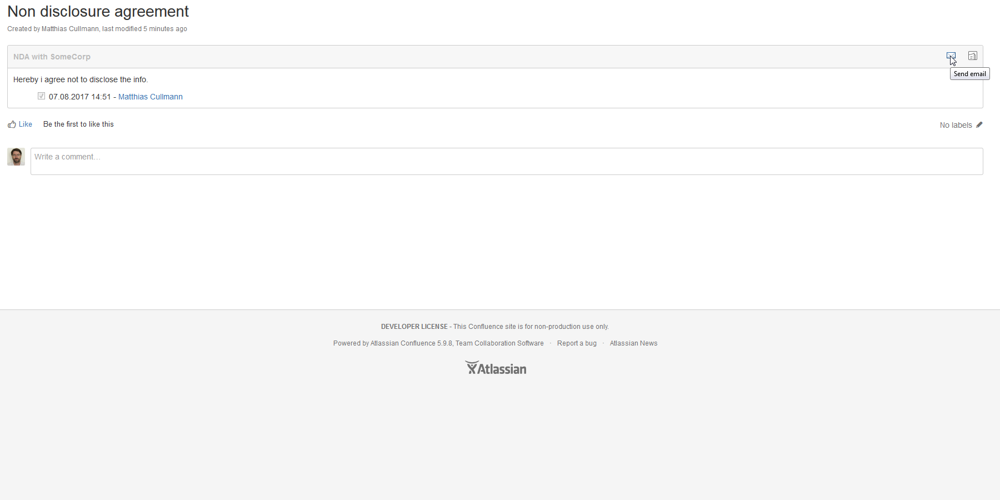

# digital-signature

A digital signature macro for [Atlassian Confluence](https://www.atlassian.com/software/confluence)

## Description
Allows confluence users to write contracts in a confluence macro which can be signed directly by logged-in users.
- content and signatures can not be modified once signed
- white list users who can sign
- report when and by whom the contract was signed
- easily send email to signers of the contract
- receive notifications, when your contract was signed

## Privacy Policy
- We do not transfer or store any data outside your Atlassian product.
- We have no access to any data you stored within your Atlassian product.
- Your data is yours - no strings attached.

## Installation & Usage
Install via [Atlassian Marketplace](https://marketplace.atlassian.com/plugins/com.baloise.confluence.digital-signature).

A detailed description of the available configuration fields and usage is described in
the [Wiki...](https://github.com/baloise/digital-signature/wiki/Signature-Macro-Usage)

## Feature overview
### Insert / edit macro

### Sign

- Set signers, title notified users and layout of the contract
- One click approval. User management is done by Confluence.
- The signature remains valid only as long the title and body are the same as at the time of signature.

### Markdown

### Mail notification

## Contribute
Keep it simple: every contribution is welcome. Either if you report an issue, help on solving one, or contribute to the
solution by adding a Pull Request.

For a more detailed answer on best practices and guidelines please have a look at our [open source community](https://github.com/baloise/open-source) at Baloise.

## Credits
This macro was written by [Matthias Cullmann](@culmat).
It is maintained in the Open Source Community at Baloise.

## License
This project is licensed under the [Apache-2.0 License](https://github.com/baloise/digital-signature/blob/master/LICENSE).

## Releases
[Build Artifacts](https://github.com/baloise/digital-signature/tree/gh-pages/release)
