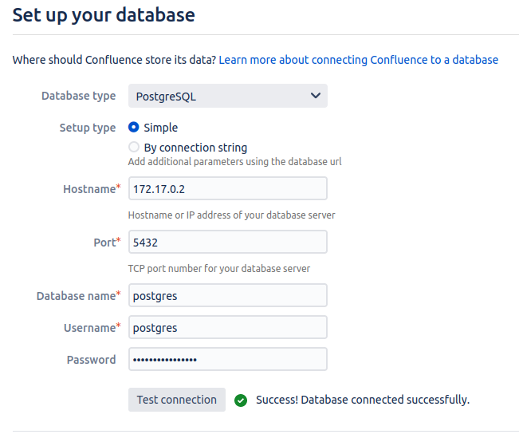

Setup following a [tutorial from coffeetime.solutions]( http://coffeetime.solutions/run-atlassian-jira-and-confluence-with-postgresql-on-docker/#Overview_of_series_How_to_run_Jira_and_Confluence_behind_NGINX_reverse_proxy_on_Docker):

```bash
mkdir -p $HOME/docker/volumes/postgres
mkdir -p $HOME/docker/volumes/confluence
docker run --name postgres -v $HOME/docker/volumes/postgres:/var/lib/postgresql/data -e POSTGRES_PASSWORD=mysecretpassword -d postgres
docker run --name=confluence -v $HOME/docker/volumes/confluence:/var/atlassian/application-data/confluence -d -p 8090:8090 -p 8091:8091 atlassian/confluence-server:latest
docker inspect postgres | grep IPAddress # get the IP address of the postgres container
```

Start confluence setup and configure Postgres:
- jdbc:postgresql://192.168.65.2:5432/postgres (`docker inspect postgres | grep IP` to get ip address)
  - in case of IP change search and replace in `/var/atlassian/application-data/confluence.cfg.xml`
- user: postgres
- password: mysecretpassword (defined above)



Skip tutorial
Create new space "Test"
